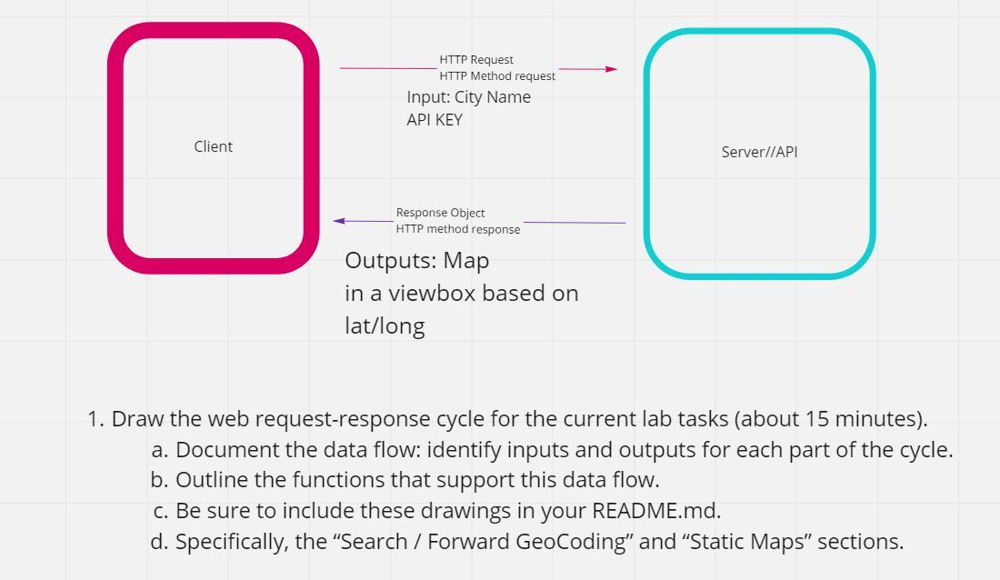

# City Explorer

**Author**: Ezgi Coban
**Version**: 1.0.0 (increment the patch/fix version number if you make more commits past your first submission)

## Overview
<!-- Provide a high level overview of what this application is and why you are building it, beyond the fact that it's an assignment for this class. (i.e. What's your problem domain?) -->

## Getting Started
<!-- What are the steps that a user must take in order to build this app on their own machine and get it running? -->

## Architecture
<!-- Provide a detailed description of the application design. What technologies (languages, libraries, etc) you're using, and any other relevant design information. -->

## Change Log
<!-- Use this area to document the iterative changes made to your application as each feature is successfully implemented. Use time stamps. Here's an example:

01-01-2001 4:59pm - Application now has a fully-functional express server, with a GET route for the location resource. -->
10-05-2022 6:07pm - Completed locations feature; city's display name, latitude and longitude are displayed when the user input is submitted.

10-05-2022 8:40 pm - Completed map feature and added CSS; image of city map is displayed as part of search result.

10-05-2022 9:50 pm - Completed error feature and added CSS; error message is displayed as result of incorrect input.

## Credit and Collaborations
<!-- Give credit (and a link) to other people or resources that helped you build this application. -->
Created WRRC whiteboard for lab 06 with Gaz.

## Lab 06 Whiteboard:

## Time Estimates

Name of feature: Locations

Estimate of time needed to complete: 1 hour (completed part of it following along in lecture)

Start time: 5:55 pm

Finish time: 6:07 pm

Actual time needed to complete: 12 minutes + (completed most of it during lecture)

-------------------------------

Name of feature: Map

Estimate of time needed to complete: 2 hours 

Start time: 7pm

Finish time: 8:40 pm

Actual time needed to complete: 1 hr 40 mins

-------------------------------

Name of feature: Errors

Estimate of time needed to complete: 1 hour

Start time: 8:50 pm

Finish time: 9:50 pm

Actual time needed to complete: 1 hr 